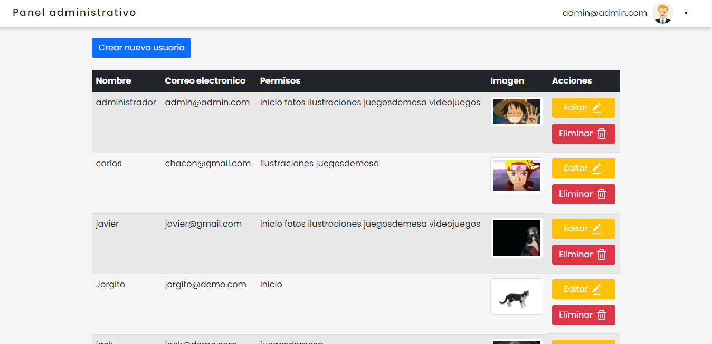
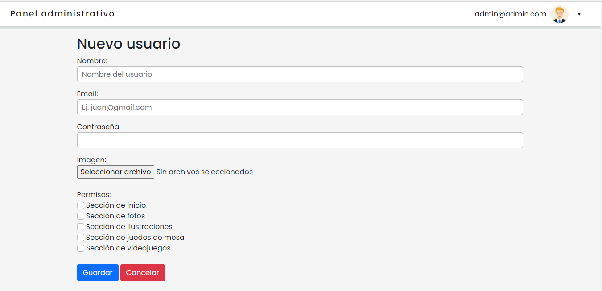
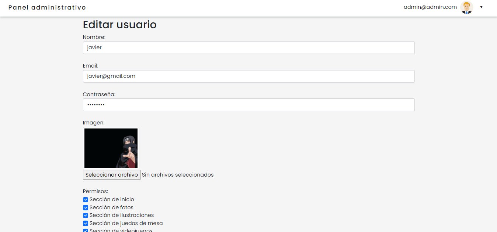
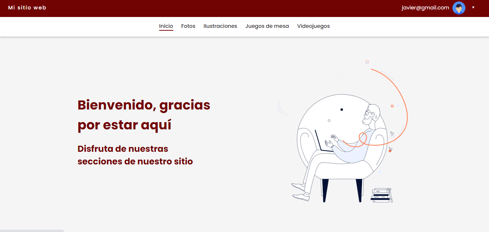
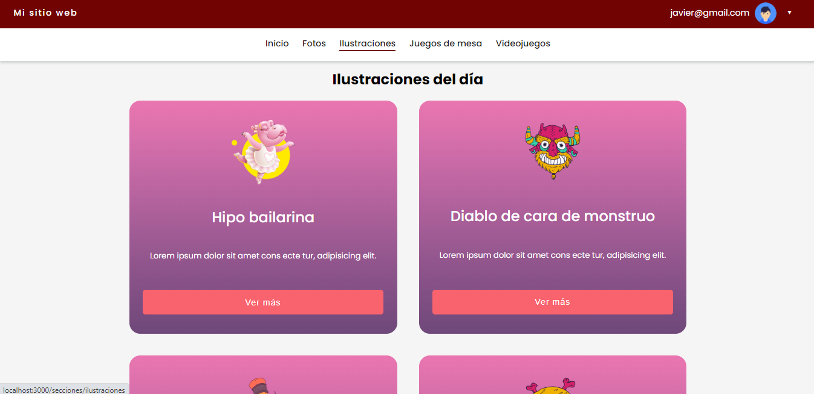
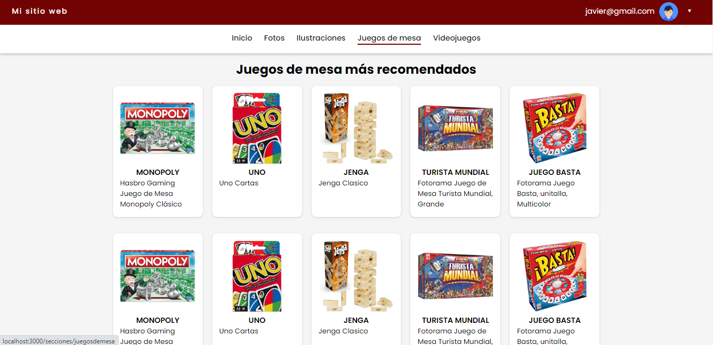
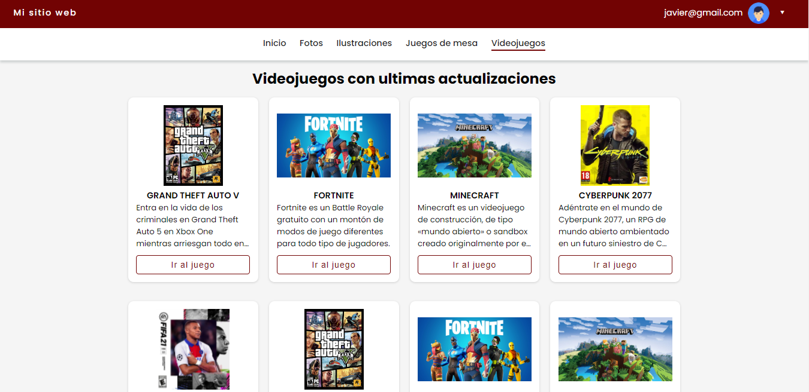

# Permisos de usuarios
 Aplicación web enfocado a los permisos y privilegios a usuarios.

__Datos de accesdos:__

- [Ver demo de la aplicación 🔗](https://permisos.vercel.app/login)
- **User**: admin@admin.com
- **Password**: admin

# Capturas

* ## Admin
Panel principal del administrador para visualizar todos los usuarios

Módulo creación de usuarios y asignación de permisos a las diversas secciones disponibles

Edición de los empleados

* ## Sitio para los usuarios
Sección de inicio 

Sección de fotos

Sección de ilustraciones 

Sección de juegos de mesa

Sección de videojuegos 

